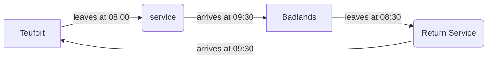

# Quickstart

## Installation
1. Make sure you have [Poetry](https://github.com/python-poetry/poetry) installed.
2. Clone the Github repository.
```bash
git clone https://github.com/TakeoIschiFan/Jikoku
cd Jikoku
```
3. Install the dependencies and the project itself using
```bash
poetry install
```

The Poetry virtual environment used to build the project should now have a `jikoku` package which can be imported into any python script.

??? tip "Poetry virtual environments"

    By default, Poetry creates virtual environments for every project in a single system folder. This makes it hard to
    track down where exactly your code is running. By executing the following command:
    ```bash
    poetry config virtualenvs.in-project true
    ```
    Poetry will make the virtual environment in a .venv folder in your current project, which you always know the location
    of and can delete/modify easily.

??? note "Other installation options"

    If you don't want to use Poetry, all dependencies are specified in `pyproject.toml`, are installable manually.
    Notably, Poetry provides a way to export the lock file to a `requirements.txt` file using the following command:
    ```bash
    poetry export -f requirements.txt --output requirements.txt
    ```


## First Jikoku Schedule

To test if the installation works, we're going to make a very simple service pattern for Jikoku to schedule.

Create a file called `my_schedule.py` and import the following modules

```python title="my_schedule.py" linenums="1"
from jikoku.models import Stop, Service
from jikoku.scheduler import schedule
from datetime import time, timedelta
```

Let's now define a simple service. In Jikoku, a service is simply a list of consecutive stops that a train calls at.
Here we model a city-pair connection between 



```python
# Define a simple service and return service
starts = time(hour=8)
ends = time(hour=9, minute=30)

first = Service("a_service", starts, ends, [Stop("Teufort", starts), Stop("Badlands",ends)])
first_return = Service( "a_return_service",starts , ends, [Stop("Badlands", starts), Stop("Teufort", ends)])

# Schedule the services
generated_schedule = schedule(all_services)
print(generated_schedule)
"""prints the following:

train-ZT4bwn
        09:00:00 - 10:30:00: Teufort => Badlands
        11:00:00 - 12:30:00: Badlands => Teufort
train-eP9nMb
        08:00:00 - 09:30:00: Badlands => Teufort
        10:00:00 - 11:30:00: Teufort => Badlands
train-hVGMEI
        08:00:00 - 09:30:00: Teufort => Badlands
        10:00:00 - 11:30:00: Badlands => Teufort
train-jzVbxj
        09:00:00 - 10:30:00: Badlands => Teufort
        11:00:00 - 12:30:00: Teufort => Badlands
"""
```

See [the Documentation](/docs) for more examples, including real word schedules from JR & SNCF! 
  
## Installation  
  
Jikoku is not available on PyPI yet. For now, download the source code and build the package locally, preferable using [Poetry](https://github.com/python-poetry/poetry).

```bash
git clone https://github.com/TakeoIschiFan/Jikoku
cd Jikoku
poetry install
```
After which, a Jikoku package should be installed in the local Poetry virtual environment.